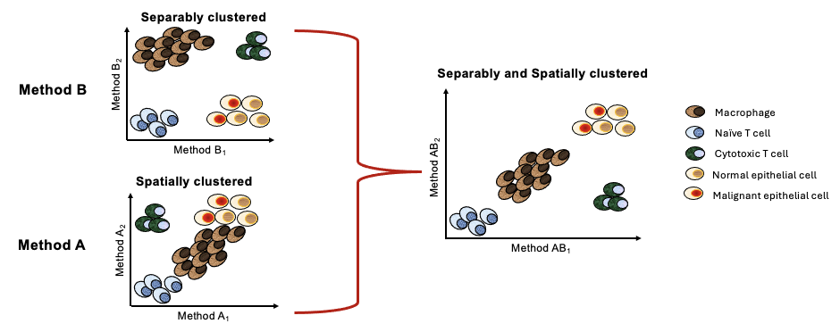

# Boosting Data Interpretation with GIBOOST to Enhance Visualization of High-Dimensional Data

$~~$

**Conventional dimensionality reduction methods (DRM) like t-SNE, UMAP, PCA, and PHATE optimize specific geometric features after data reduction such as separability and cluster sensitivity. However, these methods often fail to preserve both global and local structures, especially when used in isolation.**

**To address these limitations, we introduce GIBOOST, a novel AI tool designed to enhance the visualization and interpretability of high-dimensional single-cell data. GIBOOST integrates optimized information from various dimensionality reduction methods (DRM), ensuring alignment with the cluster sensitivity metric called the Gradient Boosting Classifier Index (GI), which aims to minimize variance and bias in the original data**

**For example, by integrating Separably clustered information and spatially clustered information, from different methods, GIBOOST enhances visualization by providing a combined Separably and spatially clustered information.**

**GIBOOST uses an optimized autoencoder to integrate reduced data from different DRMs, each optimized for distinct features such as cluster sensitivity, spatial relationships, and temporal dependencies.**

**In our application, we used four different datasets to evaluate the effectiveness of GIBOOST: EMT data, iPSC data, spermatogenesis data, and placenta development data. Each dataset presents distinct structures representing different biological phenomena. We also used four different DRM as input for GIBOOST: t-SNE, UMAP, PCA, and PHATE.**

# A quick look to the GIBOOST tool

$~~$

## Steps in the GIBOOST tool for integrating data from different DRMs to optimize the visualization and interpretability of high-dimensional data.

**GIBOOST operates in different steps as follow:**

**First (a)** GIBOOST presents a pool of different methods capable of providing reduced 2D output data from a given high-dimensional dataset

**Second (b-c)** GIBOOST introduced a metric set for data visualization and interpretability assessment, including the Separability Index (SI), Occupation Index (OI), Uniformity Index (UI), and Time Order Structure Index (TI), each evaluating different features: cluster separation, low-dimensional space coverage, uniform data spread, and spatio-temporal dependency, respectively. Given this set, GIBOOST relies on Bayesian multilevel modeling to identify the features optimized for good visualization by each method, while ensuring alignment with the feature of GI metric to minimize variance and bias.

**Third (d)** GIBOOST evaluates the additive pair scores of features from different methods in the pool and selects the most effective combination that maximizes the additive performance of GI.

**Fourth (e)** GIBOOST uses an optimized Autoencoder (AE) to integrate the two reduced datasets from the top two selected DRM. The goal is to determine the number of neurons and batch size of the AE that minimize bias and variance in the integrated data.

## Run giboost

**R Packages**
libs <- c("tensorflow", "RANN", "xgboost", "rjson", "ggplot2", "foreach", "doParallel", "Matrix", "phateR",
          "Rtsne", "umap", "brms", "keras", "reticulate", "stringr")
lapply(libs, library, character.only = TRUE)

**load single cell normalized data**
load("demo_data.rdata")
sc_data <- data.frame(demo_data)

**load labeled vector and ensure it's a factor**
load("demo_label.rdata")
label_vector <- factor(demo_label)
**Select the length of the sample data used by the AI tool in GIBOOST**
***It allows for the selection of two methods that provide complementary information for data integration.***
***The longer the data length, the more optimal the selection will be.***\
desired_length <- dim(demo_data)[1]\

source("giboost.R")\
decision <- giboost(normalized_sc_data, label_vector, desired_length)\

**Plot**
tsne_data <- data.frame(decision$tsne_data)   
ggplot(data = tsne_data, aes(x = tsne_data[,1], y = tsne_data[,2], color = demo_label)) + geom_point()
umap_data <- data.frame(decision$umap_data)
ggplot(data = umap_data, aes(x = umap_data[,1], y = umap_data[,2], color = demo_label)) + geom_point()
pca_data <- data.frame(decision$pca_data)
ggplot(data = pca_data, aes(x = pca_data[,1], y = pca_data[,2], color = demo_label)) + geom_point()
phate_data <- data.frame(decision$phate_data)
ggplot(data = phate_data, aes(x = phate_data[,1], y = phate_data[,2], color = demo_label)) + geom_point()
giboost_data <- data.frame(decision$integ_data)
ggplot(data = giboost_data, aes(x = giboost_data[,1], y = giboost_data[,2], color = demo_label)) + geom_point()
